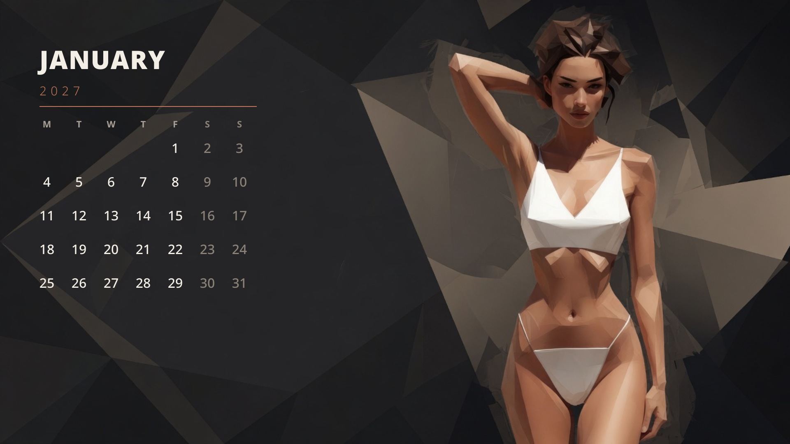
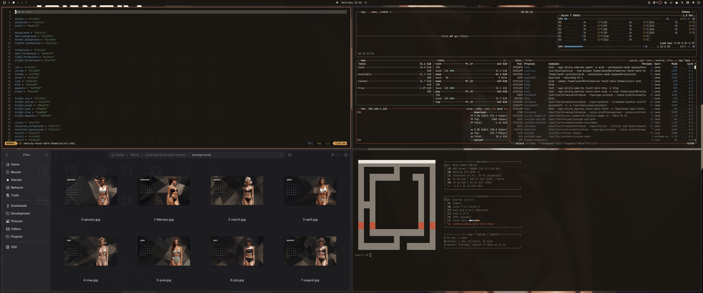

# Facet Dark

An Omarchy theme in charcoal planes, terracotta, and low-poly cream.

Dark charcoal UI, terracotta accent, cream text. The dark counterpart to [Facet](https://github.com/imcmurray/omarchy-facet-theme). Wallpapers are a 2027 calendar — the same twelve geometric fashion figures on charcoal fields, Monday-start `M T W T F S S` grids overlaid in type so the dates stay accurate.



Desktop with Neovim, btop, Files, and fastfetch:



## Install

```bash
omarchy theme install https://github.com/imcmurray/omarchy-facet-dark-theme
```

Or Omarchy menu → **Install → Style → Theme**, paste the repo URL.

Then pick a month with `Super + Ctrl + Space`.

## Palette

| Role | Hex |
| --- | --- |
| Background / charcoal | `#1a1612` |
| Foreground / cream | `#f3eee6` |
| Accent / terracotta | `#c4785a` |
| Muted | `#8a8178` |
| Selection | `#2a241e` |

## Wallpapers

January through December 2027. Each wall is one low-poly figure on the right and a verified Monday-start calendar on the left.

Prefer **16:9** at **1920×1080** (or larger). Drop new JPGs in `backgrounds/`.

## Generating more wallpapers

Keep the first block the same every time. Only swap the **figure**. Overlay the calendar in code — do not ask the image model for dates.

**Base prompt**

> Full-bleed 16:9 desktop wallpaper, single figure, no contact sheet. Low-poly geometric illustration: faceted planes, charcoal, warm black, muted taupe. A beautiful adult woman. She stands on the RIGHT two-thirds. LEFT third is a clean empty dark geometric field. Widescreen.

**Hard rules**

- Full-bleed scene — never a twelve-panel sheet
- Charcoal `#1a1612`, terracotta `#c4785a`, cream `#f3eee6`
- Calendar year **2027**, first day **Monday**, headers `M T W T F S S`
- 16:9, ideally 1920×1080 or larger

## License

MIT. Wallpapers are original illustrations created for this theme.
